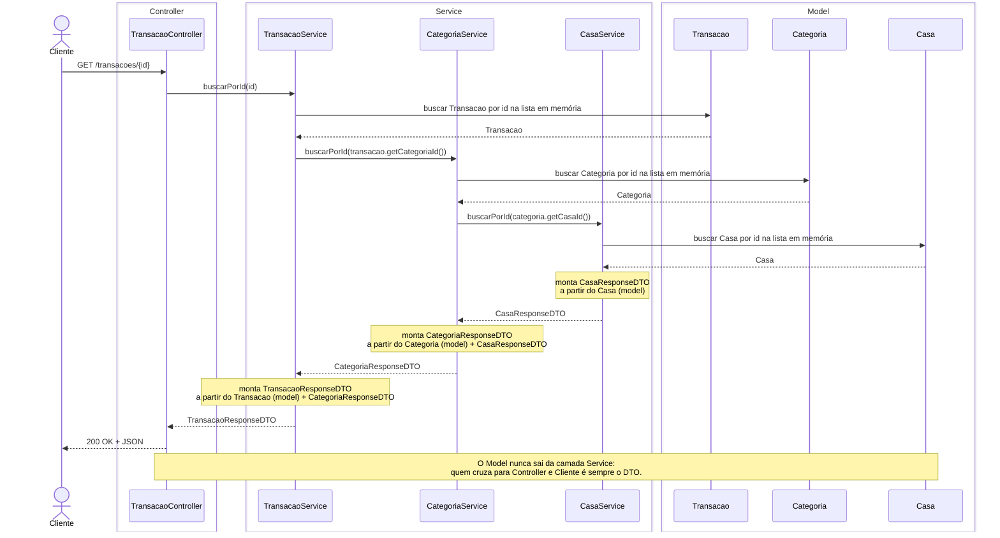
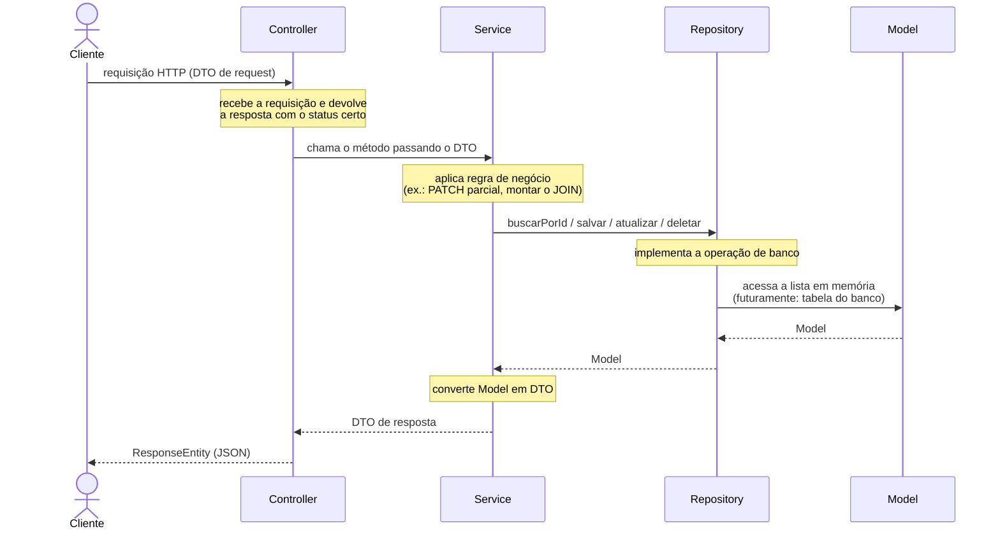

# Aula 7: Camada de repository

## Revisão: Aula 6

Na aula anterior explicamos o que é um ORM e comparamos as duas formas de representar um relacionamento em Java: **por id** (o que o projeto vinha fazendo) e **por referência de objeto** (o que um ORM faz). Implementamos, na mão, os relacionamentos 1 para N e N para M, e vimos o "JOIN manual" que os `service`s fazem para montar os DTOs de resposta.

O diagrama de sequência da aula 6 (`aulas/6_models_orm_sequencia.mmd`) resume exatamente esse fluxo para `GET /transacoes/{id}`:



Repare onde fica o `Model` nesse diagrama: ele não é uma camada própria da aplicação, é só "a lista em memória que mora dentro do `service`". Todo acesso a esse dado (buscar, listar, salvar, remover) está escrito **dentro** da classe de `service`, junto com a regra de negócio.


---

## 1. O `service` está fazendo coisa demais

Olhe de novo o `TransacaoService` da aula 6:

```java
@Service
public class TransacaoService {

    private final CategoriaService categoriaService;

    private int proximoId = 4;

    private final List<Transacao> transacoes = new ArrayList<>(List.of(
            new Transacao(1, "Almoço", 35.90, 1),
            new Transacao(2, "Corrida de aplicativo", 18.50, 2),
            new Transacao(3, "Consulta médica", 150.00, 3)
    ));

    // ...
}
```

Essa classe está fazendo, ao mesmo tempo, duas coisas bem diferentes:

1. **Implementar o "banco"**: guardar a `List<Transacao>` em memória, controlar o `proximoId`, procurar por id, adicionar, substituir, remover.
2. **Aplicar regra de negócio**: decidir o que significa um `PATCH` parcial, montar o `TransacaoResponseDTO`, decidir que o "JOIN" com `Categoria` acontece perguntando para `CategoriaService`.

Essas duas responsabilidades não têm relação uma com a outra. Trocar **como** os dados são guardados (por exemplo, trocar a `ArrayList` por um banco de dados de verdade) não deveria exigir tocar em **nenhuma** regra de negócio. Mas, do jeito que está, as duas coisas estão amarradas na mesma classe, misturadas nos mesmos métodos.

Esse é o mesmo tipo de problema que motivou a criação do `service/` lá na aula 5: uma classe acumulando responsabilidades demais. A solução é a mesma receita: separar em uma camada nova.

---

## 2. A camada `repository/`

A camada `repository/` tem uma única responsabilidade: **implementar as operações de banco**. Ler, gravar, atualizar e remover dados, nada além disso. Ela não sabe o que é um `TransacaoRequestDTO`, não decide o que fazer quando um campo do `PATCH` vem nulo, não monta nenhum DTO de resposta. Ela só entende `model`.

| Pacote | Responsabilidade | O que enxerga |
|---|---|---|
| `controller/` | Receber requisição HTTP, montar resposta com o status certo | `dto/` e `service/` |
| `service/` | Aplicar regra de negócio e converter entre `model` e `dto` | `model/`, `dto/` e `repository/` |
| `repository/` | Implementar as operações de banco (armazenar, buscar, salvar, remover) | Apenas `model/` |
| `model/` | Representar o dado armazenado | Nada além de Java puro |
| `dto/` | Formato de entrada e saída da API | Nada além de Java puro |

### 2.1 O que a anotação `@Repository` faz

`@Repository` é, como `@Service` e `@RestController`, um **estereótipo de `@Component`**: o Spring cria uma instância única dessa classe (um *bean*) e a disponibiliza para injeção em qualquer outra classe que precise dela. Até aqui, é o mesmo mecanismo que já conhecemos.

```java
package br.edu.ifpr.casalapp.repository;

import org.springframework.stereotype.Repository;

@Repository
public class TransacaoRepository {
    // ...
}
```

A diferença é que `@Repository`, diferente de `@Service` e `@RestController`, tem um efeito técnico real além de comunicar intenção. Ele ativa um mecanismo do Spring chamado **tradução de exceções de persistência**: uma classe anotada com `@Repository` recebe automaticamente um *proxy* que intercepta qualquer exceção lançada por dentro dela.

Hoje, com listas em memória, esse mecanismo não tem nenhum efeito visível: não existe `SQLException` nenhuma para traduzir. Ainda assim, `@Repository` já é a anotação correta para essa camada, porque comunica exatamente o papel dela (é aqui, e só aqui, que a aplicação conversa com a fonte de dados) e porque é a mesma anotação, com o mesmo comportamento, que continuará valendo quando essas classes passarem a usar um banco de verdade.


### 2.2 Diagrama de sequência: responsabilidade de cada camada

O diagrama abaixo (também disponível em [`aulas/7_models_orm_persistence_sequencia.mmd`](7_models_orm_persistence_sequencia.mmd)) resume, de forma genérica, o que cada camada faz e o que troca com a vizinha, agora com o `repository` no meio do caminho entre o `service` e o `model`:



Compare com o diagrama da aula 6: lá, o `service` conversava diretamente com o `model` (a lista em memória morava dentro dele). Agora existe uma camada a mais no meio do caminho, e cada seta representa uma fronteira de responsabilidade: o `controller` só troca `dto` com o `service`; o `service` só troca `model` com o `repository`; o `repository` é o único que efetivamente acessa onde o dado está guardado.

---

## 3. Refatorando o `TransacaoService`

### 3.1 `TransacaoRepository`

A lista `transacoes` e o controle de `proximoId` saem do `service` e vão para a nova classe. Os métodos trabalham só com `Transacao` (`model`), nunca com DTO:

```java
package br.edu.ifpr.casalapp.repository;

import java.util.ArrayList;
import java.util.List;

import org.springframework.stereotype.Repository;

import br.edu.ifpr.casalapp.model.Transacao;

@Repository
public class TransacaoRepository {

    private int proximoId = 4;

    private final List<Transacao> transacoes = new ArrayList<>(List.of(
            new Transacao(1, "Almoço", 35.90, 1),
            new Transacao(2, "Corrida de aplicativo", 18.50, 2),
            new Transacao(3, "Consulta médica", 150.00, 3)
    ));

    public List<Transacao> listar() {
        return transacoes;
    }

    public Transacao buscarPorId(int id) {
        for (Transacao transacao : transacoes) {
            if (transacao.getId() == id) {
                return transacao;
            }
        }
        return null;
    }

    public Transacao salvar(Transacao transacao) {
        Transacao nova = new Transacao(proximoId, transacao.getDescricao(), transacao.getValor(), transacao.getCategoriaId());
        proximoId++;
        transacoes.add(nova);
        return nova;
    }

    public Transacao atualizar(int id, Transacao atualizada) {
        for (int i = 0; i < transacoes.size(); i++) {
            if (transacoes.get(i).getId() == id) {
                transacoes.set(i, atualizada);
                return atualizada;
            }
        }
        return null;
    }

    public boolean deletar(int id) {
        for (Transacao transacao : transacoes) {
            if (transacao.getId() == id) {
                transacoes.remove(transacao);
                return true;
            }
        }
        return false;
    }
}
```

Repare em `salvar`: quem chama esse método passa uma `Transacao` **sem id definitivo** (usamos `0` como placeholder), e é a própria `TransacaoRepository` quem decide qual o próximo id e o atribui. Isso não é acidente, é assim que um banco de verdade funciona: uma coluna com auto-incremento é responsabilidade do banco, não de quem faz o `INSERT`.

### 3.2 `CategoriaRepository` e `CasaRepository`

O `TransacaoService` precisa continuar resolvendo o relacionamento com `Categoria` (e, agora, com `Casa`) para montar o `TransacaoResponseDTO`. Só que, em vez de perguntar para o `CategoriaService`, ele passa a perguntar direto para a camada de repository, que devolve `model`, não DTO:

```java
package br.edu.ifpr.casalapp.repository;

import java.util.ArrayList;
import java.util.List;

import org.springframework.stereotype.Repository;

import br.edu.ifpr.casalapp.model.Categoria;

@Repository
public class CategoriaRepository {

    private final List<Categoria> categorias = new ArrayList<>(List.of(
            new Categoria(1, "Alimentação", "prato", 1),
            new Categoria(2, "Transporte", "carro", 1),
            new Categoria(3, "Saúde", "coração", 2)
    ));

    public List<Categoria> listar() {
        return categorias;
    }

    public Categoria buscarPorId(int id) {
        for (Categoria categoria : categorias) {
            if (categoria.getId() == id) {
                return categoria;
            }
        }
        return null;
    }
}
```

`CasaRepository` segue exatamente o mesmo formato, com a lista de `Casa`.

### 3.3 `TransacaoService` refatorado

Com os três repositories disponíveis, o `service` fica só com regra de negócio: decidir como montar o DTO, como tratar um `PATCH` parcial, e orquestrar as chamadas. Nenhum `for` percorrendo lista, nenhum controle de id:

```java
@Service
public class TransacaoService {

    private final TransacaoRepository transacaoRepository;
    private final CategoriaRepository categoriaRepository;
    private final CasaRepository casaRepository;

    public TransacaoService(
            TransacaoRepository transacaoRepository,
            CategoriaRepository categoriaRepository,
            CasaRepository casaRepository) {
        this.transacaoRepository = transacaoRepository;
        this.categoriaRepository = categoriaRepository;
        this.casaRepository = casaRepository;
    }

    private TransacaoResponseDTO toResponse(Transacao transacao) {
        String categoriaNome = null;
        String casaNome = null;

        Categoria categoria = categoriaRepository.buscarPorId(transacao.getCategoriaId());
        if (categoria != null) {
            categoriaNome = categoria.getNome();

            Casa casa = casaRepository.buscarPorId(categoria.getCasaId());
            if (casa != null) {
                casaNome = casa.getNome();
            }
        }

        return new TransacaoResponseDTO(
                transacao.getId(),
                transacao.getDescricao(),
                transacao.getValor(),
                transacao.getCategoriaId(),
                categoriaNome,
                casaNome
        );
    }

    public TransacaoResponseDTO buscarPorId(int id) {
        Transacao transacao = transacaoRepository.buscarPorId(id);
        return transacao != null ? toResponse(transacao) : null;
    }

    public TransacaoResponseDTO criar(TransacaoRequestDTO request) {
        Transacao nova = new Transacao(0, request.descricao(), request.valor(), request.categoriaId());
        Transacao salva = transacaoRepository.salvar(nova);
        return toResponse(salva);
    }

    // listar, atualizar, atualizarParcial e deletar seguem o mesmo padrão:
    // delegam o acesso a dados para transacaoRepository.
}
```


---

## 4. O `TransacaoController` não mudou

Esse é o ponto central da aula: **nenhuma linha do `TransacaoController` foi alterada**. Compare:

```java
@RestController
public class TransacaoController {

    private final TransacaoService transacaoService;

    public TransacaoController(TransacaoService transacaoService) {
        this.transacaoService = transacaoService;
    }

    @GetMapping("/transacoes/{id}")
    public ResponseEntity<TransacaoResponseDTO> buscarTransacao(@PathVariable int id) {
        TransacaoResponseDTO transacao = transacaoService.buscarPorId(id);

        if (transacao != null) {
            return ResponseEntity.ok(transacao);
        }
        return ResponseEntity.notFound().build();
    }

    // ...
}
```

O `TransacaoController` continua chamando `transacaoService.buscarPorId(id)` e recebendo um `TransacaoResponseDTO` de volta, exatamente como antes. Ele nunca soube que existia uma `List<Transacao>` em memória, então trocar **onde** e **como** essa lista é mantida (saindo de dentro do `service` e indo para uma classe `repository` própria) é uma mudança invisível para ele.

Essa é a prova prática de por que a regra "o controller não conhece o `model`" (aula 5) importa: quanto menos uma camada sabe sobre a implementação da camada de baixo, menos ela precisa mudar quando essa implementação muda por dentro.

